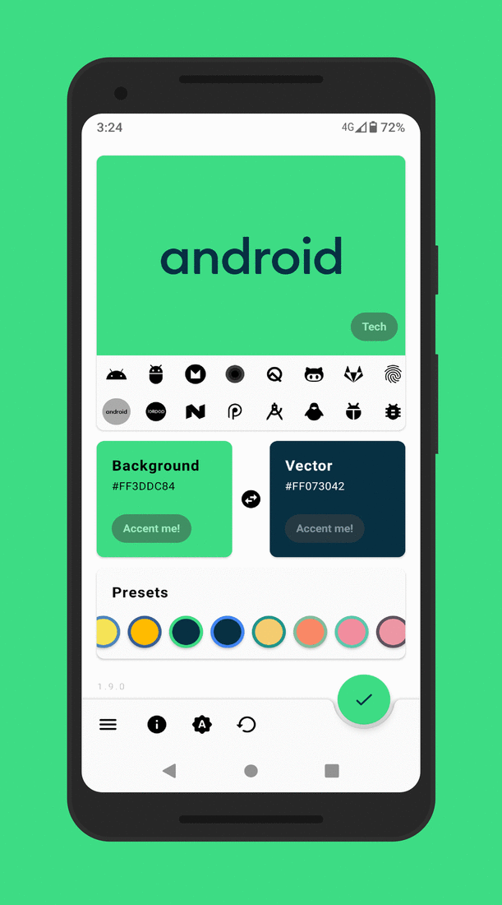

#  Vectorify da home!

# Description:

**Vectorify da home!** is a minimal and open source app to apply wallpapers from a vast (400+) collection of vector graphics:

- Background and graphic colors are customizable thanks to a fantastic color picker, presets or the device accent color. You can also swap them if You want!

- Category chooser

- Recent setups management 
  >tip: setup deletion by long click

- Preview screen where you can customize the size and position of the vector graphic

- 3 ways to set the wallpaper (save, direct apply - involves saving, live wallpaper)
  >note: wallpapers are now being saved to /Pictures folder.

- Light, dark and automatic (following the system settings on Android Q and battery level on older devices) themes

# Downloads

# Want to contribute to translations?

Help translate the project on [weblate](https://hosted.weblate.org/engage/vectorify-da-home/). Consider supporting the Weblate guys by sending a [donation](https://weblate.org/it/donate/new/) with our full approval :)

# License

Copyright © 2021 **Enrico D'Ortenzio**

This repository is copylefted libre software, licensed [Apache 2.0](http://www.apache.org/licenses/LICENSE-2.0), as described in the [LICENSE](LICENSE.md) file.
Use, study, change and share at will; with all.